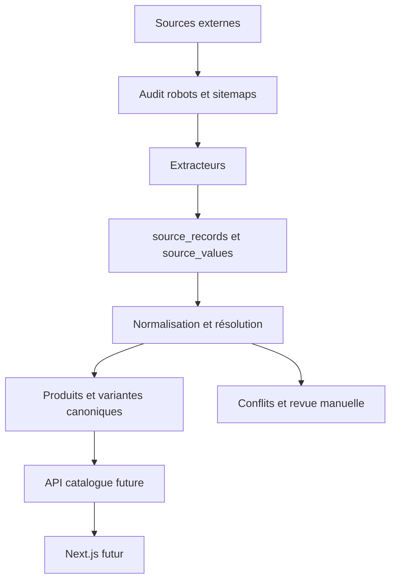

# Architecture

## Décision structurante

Le catalogue est servi exclusivement depuis notre PostgreSQL. Les sites externes sont des sources d'import et de vérification, jamais des dépendances de lecture de l'application.

## Couches

- `src/importers` : HTTP poli, index de sitemaps et parseurs sans état.
- `src/domain` : références et résolution déterministe des valeurs.
- `src/pipeline` : persistance idempotente, historique source et hash.
- `src/report` : métriques calculées en base.
- `prisma` : modèle, migration initiale et sources de départ.

Les parseurs n'écrivent pas directement les champs canoniques. Ils produisent un `RawCollectible`, puis le pipeline conserve le record brut et les valeurs individuelles. Cela rend possible le retraitement sans nouveau téléchargement.

## Incrémentalité

Chaque `SourceRecord` possède `contentHash`, `sourceUpdatedAt`, `firstSeenAt`, `lastSeenAt` et `lastCheckedAt`. Un index de sitemap fournit les URL et dates de modification ; seuls les records nouveaux ou modifiés doivent ensuite être relus. Les erreurs sont isolées par fiche dans un `ImportRun`.

## Choix web différé

Le MVP Next.js n'est pas initialisé tant que le catalogue réel n'a pas franchi des seuils documentés. Cela évite de figer une API autour d'une taxonomie encore non validée.
